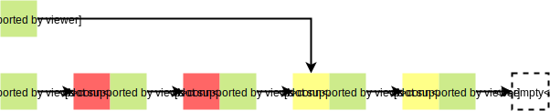
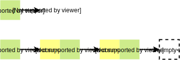
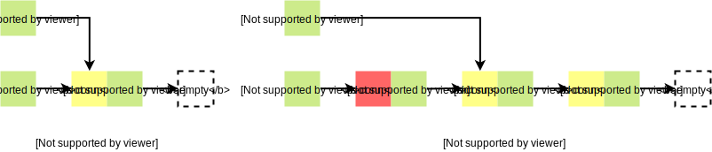

# go-connpool

[](https://travis-ci.com/blinklv/go-connpool)
[](https://godoc.org/github.com/blinklv/go-connpool)
[](LICENSE)

A concurrency-safe [connection pool][] package in [Go][]. It can be used to manage and reuse connections based on the destination address of which. This design makes a pool work better with some [name server][]s.

## Motivation

In some cases, your backend servers have multiple addresses. Before you access a specific server, you need to get the address of which from a name server. The configuration of addresses in the name server usually will be modified in the future, like removing records or adjusting weights. So a connection pool which can respond to these changes quickly is needed, which is why this pool exists. 


## Installation

```bash
$ go get github.com/blinklv/go-connpool
```

## Usage

I only introduce some simple usages here. The more details of **API** you can get from [GoDoc](https://godoc.org/github.com/blinklv/go-connpool).

#### Create and Close A Connection Pool

You need to create a `Pool` instance at first. There're three parameters you should specify. 

- `dial`: defines how to create a new connection.
- `capacity`: controls the maximum idle connections to keep **per-host** (*not all hosts*).
- `period`: specifies period between two cleanup ops, which closes some idle connections not used for a long time (*about 1 ~ 2 period*). It can't be less than 1 min in this version; otherwise, many CPU cycles are occupied by the cleanup task. I usually set it to 3 ~ 5 min, but if there exist too many resident connections in your program, this value should be larger.

You can make some operations on this `Pool` instance after creating it successfully. If you don't use it anymore, please remember to close it. Invoking `Pool.Close` method can ensure that all resources related to the connection pool will be released.

```go
dial := func(address string) (net.Conn, error) {
    return net.Dial("tcp", address)
}

pool, err := connpool.New(dial, 128, 5*time.Minute)
if err != nil {
    log.Fatalf("create connection pool failed %s", err)
}

run(pool)

pool.Close()
```

#### Get and Create Connections From A Pool

You can get a connection from your `Pool` instance, the destination address of which is equal to the `address` argument passed by you. If there exist some idle connections related to this address in the pool, one of which will be returned directly to you. I think this is why we use the connection pool. 

```go
conn, err := pool.Get(selectAddress())
if err != nil {
    return err
}
if err = handle(conn); err != nil {
    return err
}
return conn.Close()
```

`selectAddress` and `handle` function in the above example are your custom functions. The former one can return an available destination address; it's usually related to a name server. The latter one specifies how to handle the connection. How should we do if we get a dead connection, which means the connection has been closed by the peer but not detected? Can we invoke `Pool.Get` method with the same address again? It can work in typical cases. However, what if we still fail? The most terrible thing is that all idle connections corresponded to the address have been dead, which might happen when the backend server was crashed. In this lousy case, retrying will take a lot of time. `Pool.New` is an alternative method; it's more suitable for solving this problem. 

```go
address := selectAddress()
conn, err := pool.Get(address)
if err != nil {
    return err
}

if err = handle(conn); err != nil && isClosed(err) {
    conn.(*connpool.Conn).Release()
    if conn, err = pool.New(address); err != nil {
        return err
    }
    err = handle(conn)
}

conn.Close()
return err
```

`Pool.New` creates a new connection by using the underlying dial field instead of acquiring an existing connection in the pool. This way can guarantee to get a valid connection in the first retrying unless the background can't serve normally. No matter which way we use to get a connection from the pool, we must close it at the end. `Conn.Close` method tries to put the connection into the pool if there is enough room in which. This step is very critical, so you shouldn't ignore it; Otherwise, no connection will be reused. In fact, even though you don't use any connection pool, closing connections is necessary to prevent resource leak. 

#### Release Connections

Have you noticed the statement `conn.(*connpool.Conn).Release()` in the above example?

```go
if err := handle(conn); err != nil && isClosed(err) {
    conn.(*connpool.Conn).Release()
    // ... 
}
```

Although the connection was dead, it doesn't mean you free its resources. We shouldn't call its `Close` method, because the invalid connection will be likely put into the pool again. By contrast, `Conn.Release` method is better, which can free the underlying connection directly. This strategy avoids that dead connections are repeatedly used.

## Internal Implementation


Idle connections in the pool are placed to different areas named **bucket** according to their destination address; the connections of one bucket will be organized to the **singly** linked list. When users call the `Pool.Get` method, the pool will map the address parameter to a bucket at first. If the corresponded bucket is not empty, then gets a connection from which by using the `bucket.pop` method; otherwise, the `dial` function will be invoked to create a new connection which will be bound to the bucket. Of course, no matter which way, the connection will be returned to the users. After users have finished using the connection, it will be put back to the bucket by using the `bucket.push` method. 

**Connection**

```go
type Conn struct {
    net.Conn
    b *bucket
}
```

A connection gotten from the pool is not the same as ones returned by the `dial` function, even if you invoke the `Pool.New` method. Its underlying type as above, which wraps the raw `net.Conn` interface to give the `Conn.Close` method new meaning: **Not Release, But Reuse**. If the bucket which a connection binds to isn't closed and has enough room, puts the connection to it when you call the `Conn.Close` method; otherwise, release it.

**Bucket**

```go
type element struct {
    conn *Conn
    next *element
}
```

The bucket is the core struct of the pool which stores idle connections of a specific destination address. It organizes connections into the singly linked list; the above **element** struct represents the [node][] of which. We use an empty element (`&element{}`) instead of `nil` as the terminator of the bucket; so even if a bucket is empty, its head pointer (`top`) is not nil. The bucket has two principal operations:

- `push`: which puts a connection to the top of the bucket.
- `pop`: which removes the top connection of the bucket and returns it to users.

So you can think the bucket as a [stack][].

**Cleanup**

Except for the `push` and the `pop`, there exists the third important method of the bucket: `cleanup`, which will clean up the idle connections of the bucket.

*1. What does cleaning up idle connections mean?*

Although all connections hold in a bucket are idle, some of which are used recently and some not. When the `cleanup` is called, it will remove the connections not used recently of the bucket and release their resources.

*2. What's the meaning of not used recently?*

The `cleanup` method of a bucket will be invoked periodically. At the beginning of a cycle, all idle connections of a bucket are thought as unused. At the ending of the cycle, some of which have been used by users but some not. We think the connections in the latter case are **not used recently**, they will be cleaned.

*3. How to distinguish between used and unused connections?*

I have said that you can think the bucket as a [stack][], which has a valuable property: **LIFO(last in, first out)**. This property can derive a useful conclusion: **all used connections cluster in the upper half of the bucket**. So we only need an additional `cut` pointer to separate these two types of connections.



> **NOTE**: Red blocks represent used connections; yellow blocks represent unused connections.

*4. How to clean up unused connectionns?*

Assume we have a correct `cut` pointer which separates used and unused connections; the following codes show how does the `cleanup` work.

```go
var cut element

// Cause the bucket is an shared object, we need to lock it before accessing.
bucket.lock()

// Using a temporary cut variable reserve the head of unused connections.
cut = *(bucket.cut)         

// Using an empty element overwrite the element referenced by the cut 
// field. Cause we use an empty element as the terminator of the bucket, 
// this operation will remove unused connections.
*(bucket.cut) = element{}   

// Assign nil to the cut field, which means resetting it to the uninitialized state.
bucket.cut = nil

bucket.unlock()

// Loop through all unused connections and release their resources; this process
// is not in the critical region so that it won't block other operations.
for e := &cut; e.conn != nil; e = e.next {
    e.conn.Release()
}

```

After the cleanup work has done, the cut pointer of the bucket is uninitialized (as follows).



*5. How to maintain the cut pointer?*

Let's start with a bucket as above picture. Both the `push` method and the `pop` method can initialize the cut pointer, but the practical effect will be different.



## License 

This project is licensed under the MIT License - see the [LICENSE](LICENSE) file for details

[connection pool]: https://en.wikipedia.org/wiki/Connection_pool
[Go]: https://golang.org/
[name server]: https://en.wikipedia.org/wiki/Name_server
[node]: https://en.wikipedia.org/wiki/Node_(computer_science)
[stack]: https://en.wikipedia.org/wiki/Stack_(abstract_data_type)
