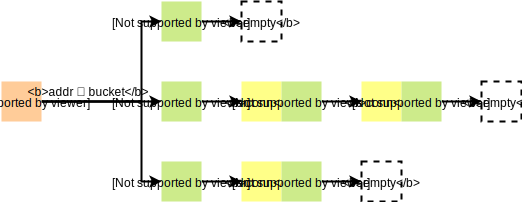
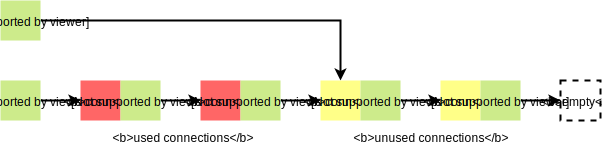
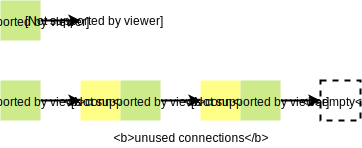
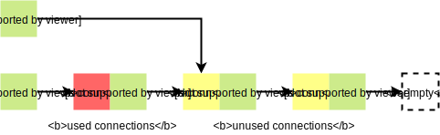
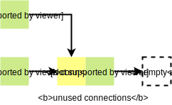

# go-connpool

[](https://travis-ci.com/blinklv/go-connpool)
[](https://godoc.org/github.com/blinklv/go-connpool)
[](LICENSE)

A concurrency-safe [connection pool][] package in [Go][]. It can be used to manage and reuse connections based on the destination address of which. This design makes a pool work better with some [name server][]s.

## Motivation

In some cases, your backend servers have multiple addresses. Before you access a specific server, you need to get the address of which from a name server. The configuration of addresses in the name server usually will be modified in the future, like removing records or adjusting weights. So a connection pool which can respond to these changes quickly is needed, which is why this pool exists. 


## Installation

```bash
$ go get github.com/blinklv/go-connpool
```

## Usage

I only introduce some simple usages here. The more details of **API** you can get from [GoDoc](https://godoc.org/github.com/blinklv/go-connpool).

#### Create and Close A Connection Pool

You need to create a `Pool` instance at first. There're three parameters you should specify. 

- `dial`: defines how to create a new connection.
- `capacity`: controls the maximum idle connections to keep **per-host** (*not all hosts*).
- `period`: specifies period between two cleanup ops, which closes some idle connections not used for a long time (*about 1 ~ 2 period*). It can't be less than 1 min in this version; otherwise, many CPU cycles are occupied by the cleanup task. I usually set it to 3 ~ 5 min, but if there exist too many resident connections in your program, this value should be larger.

You can make some operations on this `Pool` instance after creating it successfully. If you don't use it anymore, please remember to close it. Invoking `Pool.Close` method can ensure that all resources related to the connection pool will be released.

```go
dial := func(address string) (net.Conn, error) {
    return net.Dial("tcp", address)
}

pool, err := connpool.New(dial, 128, 5*time.Minute)
if err != nil {
    log.Fatalf("create connection pool failed %s", err)
}

run(pool)

pool.Close()
```

#### Get and Create Connections From A Pool

You can get a connection from your `Pool` instance, the destination address of which is equal to the `address` argument passed by you. If there exist some idle connections related to this address in the pool, one of which will be returned directly to you. I think this is why we use the connection pool. 

```go
conn, err := pool.Get(selectAddress())
if err != nil {
    return err
}
if err = handle(conn); err != nil {
    return err
}
return conn.Close()
```

`selectAddress` and `handle` function in the above example are your custom functions. The former one can return an available destination address; it's usually related to a name server. The latter one specifies how to handle the connection. How should we do if we get a dead connection, which means the connection has been closed by the peer but not detected? Can we invoke `Pool.Get` method with the same address again? It can work in typical cases. However, what if we still fail? The most terrible thing is that all idle connections corresponded to the address have been dead, which might happen when the backend server was crashed. In this lousy case, retrying will take a lot of time. `Pool.New` is an alternative method; it's more suitable for solving this problem. 

```go
address := selectAddress()
conn, err := pool.Get(address)
if err != nil {
    return err
}

if err = handle(conn); err != nil && isClosed(err) {
    conn.(*connpool.Conn).Release()
    if conn, err = pool.New(address); err != nil {
        return err
    }
    err = handle(conn)
}

conn.Close()
return err
```

`Pool.New` creates a new connection by using the underlying dial field instead of acquiring an existing connection in the pool. This way can guarantee to get a valid connection in the first retrying unless the background can't serve normally. No matter which way we use to get a connection from the pool, we must close it at the end. `Conn.Close` method tries to put the connection into the pool if there is enough room in which. This step is very critical, so you shouldn't ignore it; Otherwise, no connection will be reused. In fact, even though you don't use any connection pool, closing connections is necessary to prevent resource leak. 

#### Release Connections

Have you noticed the statement `conn.(*connpool.Conn).Release()` in the above example?

```go
if err := handle(conn); err != nil && isClosed(err) {
    conn.(*connpool.Conn).Release()
    // ... 
}
```

Although the connection was dead, it doesn't mean you free its resources. We shouldn't call its `Close` method, because the invalid connection will be likely put into the pool again. By contrast, `Conn.Release` method is better, which can free the underlying connection directly. This strategy avoids that dead connections are repeatedly used.

## Internal Implementation



All idle connections related to a specific address will be organized to linked list which named `bucket` (aka `conn-list`). When users call the `Pool.Get` method, the pool will map the address parameter to the `bucket` at first, and then pop a connection from which. If the corresponded bucket is empty, the `dial` function will be invoked to create a new connection bound to the bucket. No matter which way the connection generated by, it will be pushed to its bucket when users call the `Conn.Close` method. Maybe you have already noticed that the core struct of the pool is `bucket` (or `conn-list`), we will dig into which.

**Connection**

```go
type Conn struct {
    net.Conn
    b *bucket
}
```

The connections returned by the pool are not exactly the same as ones returned by the `dial` function, even if you invoke `Pool.New` method. It wraps the raw `net.Conn` interface to give the `Conn.Close` method new meaning: **Not Release, But Reuse**. If the pool which a connection binds to isn't closed and has enough room, puts the connection to the pool.

**The Basic Element of Bucket**

```go
type element struct {
    conn *Conn
    next *element
}
```

The underlying structure of the bucket is the **singly** linked list; the above `element` struct represents the [node][] of which. We use an empty element (`&element{}`) instead of `nil` as the terminator of the linked list; so even if a bucket is empty, its head pointer (`top`) is not nil.

**Working Set**

If a connection is put to the bucket by using the `bucket.push` method, we can think it has been used recently. **Working Set** is a collection of connections which are used in a period of time. If some connections of a bucket don't belong to the working set, we can reduce the size of the bucket by cleaning up these unused connections. There is a primary question we need to care about:

> How to separate **used** connections and **unused** connections?

We can allocate each element a state bit to indicate whether a connection has been used recently; all state bits are initialized to `false` (*unused*). When a connection is pushed to the bucket, its state bit is set to `true` (*used*). So the corresponding separation process is as follows (*pseudocode*):

```go
var used_top, unused_top *element

bucket.lock()

// Iterate each element of the bucket (singly linked list).
for e := range bucket.top {
    if e.state {
        add e to used_top
    } else {
        add e to unused_top
    }
}
bucket.top = used_top   // Replace bucket.top with used_top
bucket.unlock()

cleanup(unused_top)     // Cleanup (release) unused connections
```

It works, but maybe not efficient. Cause the time complexity of the codes in the critical region of the bucket is **O(n)**, which means other user common operations (`bucket.push` and `bucket.pop`) will be blocked for a long time when there exist too many connections in the bucket. Have you notice that getting a connection from the bucket is called `pop` and putting a connection to the bucket is called `push`? What abstract data types have these two principal operations? It's [stack][]! The core feature of stack is **LIFO(last in, first out)**, which can lead to a useful conclusion: **All used connections cluster in the upper half of the bucket**. We only need one `cut` pointer to seperate these two types of connections. 



**Cleanup Strategy**

Now, we assume we have a correct `cut` pointer;the following codes (*pseudocode*) gives you a more efficient way to cleanup unused connections.

```go
var cut *element

bucket.lock()
cut = *b.cut                // Using a temporary cut variable reserve the head of unused connections.
(*bucket.cut) = element{}   // Using an empty element overwrite the cut field.
bucket.unlock()

cleanup(cut)                // Cleanup (release) unused connections.
```

The code in critical region of the bucket is simple (*time complexity O(1)*) but powerful (*seperate two types of conns*). Using an empty element overwrite the cut field means adjust the terminator of the bucket to the successor of the last used idle connections.

**Maintain Cut Pointer**

`cut` pointer makes our solution more efficient. But how does it come from? How should we maintain a correct cut field to make it always pointer to the first unused connection? We assume a bucket has been cleaned up just now; it's in the initial state and cut pointer is nil (which means all idle connections are unused).



Both the `bucket.push` method and the `bucket.pop` method can initialize it. If the push method is called at first, the bucket will be like this.



The first used connections (*red block*) is just added. If the pop method is called at first, the situation will be different. 



## License 

This project is licensed under the MIT License - see the [LICENSE](LICENSE) file for details

[connection pool]: https://en.wikipedia.org/wiki/Connection_pool
[Go]: https://golang.org/
[name server]: https://en.wikipedia.org/wiki/Name_server
[node]: https://en.wikipedia.org/wiki/Node_(computer_science)
[stack]: https://en.wikipedia.org/wiki/Stack_(abstract_data_type)
